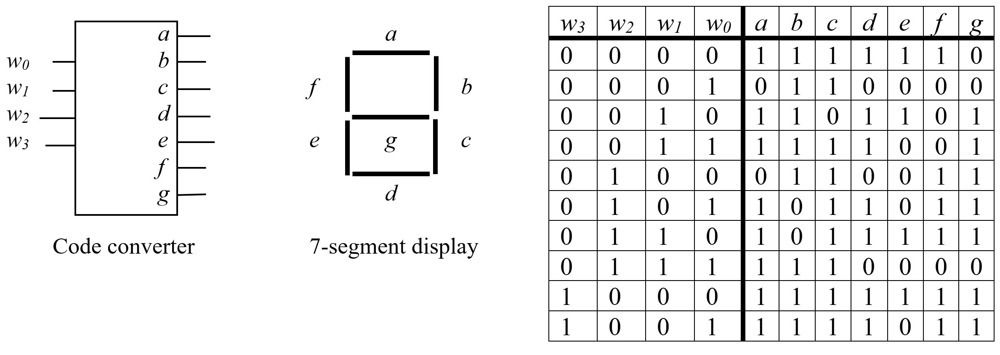

:Author: Justin Perona

================
ECS 154A - Lab 1
================

Due by 08:59 on Monday, 2018-08-13.
Turn in for the Logisim portion is on Canvas.
Submit one file named lab1.circ.

Written Problems
----------------

The written portion of the assignment won't be collected.
So, yes, this means that it's "optional."
That being said, you'll want to do a good portion of the written problems before the quiz, as the problems here will be similar to the questions on the quiz.

1. Use algebraic minimization to prove that (A + B) * (A + ~B) = A.
2. Does (A * ~B) + (B * C) + (~A * ~C) = (A * C) + (~B * ~C) + (~A * B)? Show how you made your decision.
3. If two equations have the same truth table outputs for every input, then the two equations are identical. Prove the OR version of DeMorgan's law, ~(A + B) = ~A * ~B, in this fashion.
4. Draw out the circuit for the following equation: f(A, B) = AB + ~A~B. Then, draw a timing diagram for the same circuit. Show the waveforms that can be observed on all wires in the circuit.
5. Use the circuit diagram that you drew for the previous problem. Assume that an AND gate has a gate delay of 5 ns, an OR gate has a gate delay of 4 ns, and a NOT gate has a delay of 3 ns. Shade the worst-case path(s) on the diagram.
6. Use the circuit diagram and times from the previous problem. Assume that inputs become valid at time 0 ns. How long does it take for the output *f* to become valid?
7. Find a minimum SOP expression for f(A, B, C) = m0 + m1 + m2 + m3 + m4 + m6 + m7.
8. Find a minimum SOP expression for f(A, B, C, D) = m0 + D1 + m2 + D3 + D6 + D7 + m8 + m9 + m10 + D11 + m15.
9. Find a minimum SOP expression for f(A, B, C, D) = A~B~C + ABD + BCD + ~A~B~C~D.
10. For a four-variable expression, what is the minterm m5? What is the maxterm M13?
11. If I want a multiplexer to have 128 inputs, how many select bits do I need to have?
12. We want to create a odd parity checker that takes a 4-bit binary number and inserts a 0 or 1 as the 5th, most significant, bit. For the numbers 0001, 0110, 1111, and 0000, what are the parity checker's corresponding outputs?
13. Much like how we can implement circuits using MUXes (see `the MUX problem below`_), we can do the same with only a decoder and an OR gate. Implement the function f(A, B, C) = m0 + m1 + m4 + m6 + m7 using a 3-to-8 decoder and an OR gate.
14. For the following timing diagram, synthesize the function f(A, B, C) in the simplest SOP form.

Logisim Problems [50]
---------------------

**DO NOT MODIFY THE MAIN SUBCIRCUIT THAT CONTAINS THE TESTING COMPONENTS.**
**DOING SO WILL LEAD TO AN AUTOMATIC ZERO.**
**YOU HAVE BEEN WARNED.**

You must use designs relying on only AND gates, OR gates, XOR gates, NOT gates, MUXes, decoders, and the Logisim wiring library, unless specified otherwise.
Create your designs for each problem in the appropriately labeled subcircuit.

You will look at the contents of a shift register or TTY and last input probe to determine if your circuit is working properly.
The grading circuits in main explain how to check if your output is correct for each problem.

1. Quick introduction to Logisim [4]
~~~~~~~~~~~~~~~~~~~~~~~~~~~~~~~~~~~~

Create two circuits using gates for the following functions.
You may not use a MUX for this problem.

    f(A, B, C, D) = A!B!C + AB!D + BC!D + ABC
    
    g(A, B, C, D) = A!B + B!C + BD

You can use the Hand Tool to double-click into the subcircuit in *main*, or double-click the relevant subcircuit in the left sidebar.
The basic gates are on the top toolbar, or you can open the Gates folder in the left sidebar.

I highly recommend using tunnels, and continuing to use them throughout the rest of the labs.
It allows you to move a value from one part of the circuit to another without having to drag a wire all the way across.
You can create tunnels for all the inputs (ABCD) and their complements.
Instead of hooking up the inputs directly to the gates, you can hook up duplicates of the tunnels instead.

Once you're finished with a subcircuit and want to test it, go back to *main* and look at the output in the shift register and last output probe.
You can either press Ctrl-T to tick once, or Ctrl-K to keep ticking.
If you want the simulation to go faster, change the tick frequency in Simulate -> Tick Frequency.
Finally, you can reset the simulation back to the start with Ctrl-R, to test again after you make changes.

2. Karnaugh map [6]
~~~~~~~~~~~~~~~~~~~

Derive a minimum sum-of product expression for the following function:

    f(A, B, C, D) = D2 + m3 + m5 + D7 + D8 + m9 + m12 + m13

m stands for minterm, and D stands for don't care.

Implement your function in Logisim.
You may not use a MUX for this problem.

3. Seven-segment display [10]
~~~~~~~~~~~~~~~~~~~~~~~~~~~~~

Given the following BCD-to-7-segment display code converter, derive minimal sum-of-products expressions for the outputs *a*, *b*, *c*, *d*, *e*, *f*, and *g* of the 7 segment display.
Implement the resulting circuits in Logisim.
You may not use a MUX for this problem.

You can see the intended output for each input in main.

4. Bit counting [4]
~~~~~~~~~~~~~~~~~~~

Suppose we want to determine how many of the bits in a eight-bit unsigned number are equal to one.
Design the simplest circuit that can accomplish this task.

You may use any Logisim component for this problem.

.. _`the MUX problem below`:

5. MUX function implementation [4]
~~~~~~~~~~~~~~~~~~~~~~~~~~~~~~~~~~

Implement the following function using a MUX:

    f(A, B, C) = m0 + m2 + m4 + m6

You may not use gates for this problem.
You may only use a MUX, constants, power, and ground.

6. Parity checker [5]
~~~~~~~~~~~~~~~~~~~~~

Implement a simple odd parity checker.
Given an eight bit number, output a ninth bit that ensures the total number of bits that are 1 is odd.

There is a parity gate in Logisim for both types of parity (though they are somewhat confusingly named).
It defeats the purpose of this assignment if you use those, so you may not use either of them.
That being said, it's possible to finish this problem using only one gate.

7. 3 bit ALU [18]
~~~~~~~~~~~~~~~~~

Design a 3-bit ALU using Logisim.
Each bit cell should be able to perform the following operations:

* ADD/SUB
* AND
* OR
* XOR

Your ALU should use carry-lookahead logic to improve performance, so you'll need to implement the carry-lookahead logic as another portion of your circuit.
Feel free to make another subcircuit for this, if that works better for you.

All arithmetic operations will be on 2's complement numbers.
This only matters for the ADD/SUB operations, since the others are performed bitwise.

Probes have been included in main to help you debug your circuit.
The ones on the top are in binary for AND, OR, and XOR.
The ones underneath are in signed decimal for ADD and SUB.

Selector bits
"""""""""""""

Given the following input as the selector lines, your ALU should perform the appropriate operation:

* 00 = XOR
* 01 = OR
* 10 = AND
* 11 = ADD/SUB

Input pins
""""""""""

Your input pins will be the following.
Note that A2/B2/S1 are the most significant bits, and A0/B0/S0 are the least significant bits.
We will follow this naming convention for the rest of the class.

* A operand: A2, A1, A0
* B operand: B2, B1, B0
* Selector bits: S1, S0
* Carry into the bottom cell: CIN

Output pins
"""""""""""

Your three output pins will be the bits that form the output, C2, C1, and C0.
