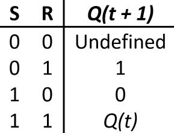
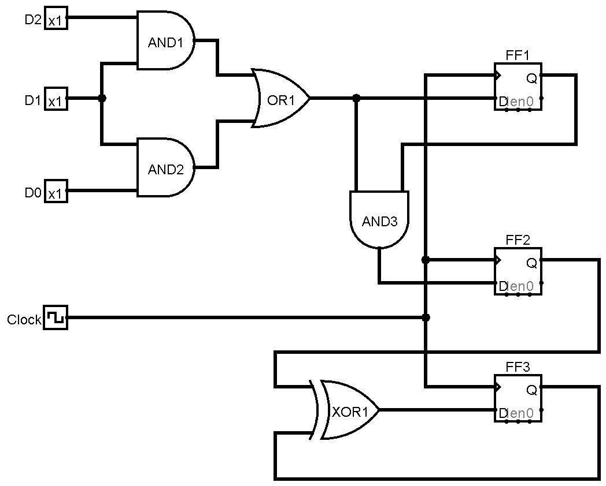
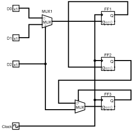
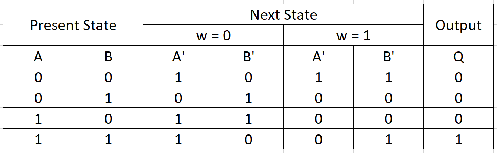

:Author: Justin Perona

================
ECS 154A - Lab 2
================

Due by 09:00 on Monday, 2018-08-27.
Turn in for the Logisim portion is on Canvas.
Submit two files, named lab2a.circ and lab2b.circ.
(Both parts of the assignment are due on the date specified above.)
Include your name and your partner's name (if necessary) either as a submission comment on Canvas, or in the text entry box when submitting.
Only one partner needs to submit.

Partners are suggested, but not mandatory for the Logisim portion of each lab.
Sharing ideas between groups is fine, but sharing .circ files is not.
Since the written portion is "optional," feel free to do those alone or with your partner.

Written Problems
----------------

Since this lab spans multiple weeks, both the written portion and Logisim portions are divided into their representative weeks.

Week 2
~~~~~~

*Error Correction*

1. What is the difference between a hard failure and a soft error?
2. Use the 4-bit error correcting circuit that we discussed in class to determine the valid code words associated with the data values *1100* and *0101*.
3. Using the 4-bit error correcting circuit that we discussed in class, are the following code words valid: *1100110* and *0001111*? If not, what bit was flipped, and what is the valid code word associated with the invalid one?
4. What is the minimum Hamming distance between valid code words required to be able to detect 4 errors? What is the minimum Hamming distance between valid code words required to be able to correct 4 errors?
5. We are going to expand the error correction circuit that we discussed in class. If now we have 6 data bits and 4 check bits determine the data bit placement, check bit placement, and which check bits cover which data bits.
6. Using the placements from the previous problem, determine the valid code word associated with the data 110011.

*Sequential Circuits*

7. What is the biggest difference between combinational and sequential logic?
8. Draw out the state transition table for a S-R NAND flip flop. The characteristics table for this table is below.

9. Using the state transition table from #8, draw the state transition diagram for a S-R NAND flip flop. (Normally we do things in the opposite direction, but this way is easier for this problem.)
10. What separates a clocked latch from a flip flop?
11. What functionality separates a register from a counter?
12. For the following circuit with flip flops, determine the worst case path in terms of time. Give the components along the worst case path, and determine how long the clock time of the circuit is.

The delays for the components in the above image are as follows:

- DFF propagation delay: 4 ns
- DFF setup time: 6 ns
- XOR gate: 2 ns
- AND gate: 3 ns
- OR gate: 3 ns

13. (from discussion) For the following circuit with flip flops, determine the worst case path in terms of time. Give the components along the worst case path, and determine how long the clock time of the circuit is.

The delays for the components in the above image are as follows:

- DFF propagation delay: 3 ns
- DFF setup time: 5 ns
- MUX delay: 4 ns

Week 3
~~~~~~

1. We want to implement a Mealy FSM that outputs a 1 when at least two of the last three bits input into the FSM were 1, and 0 at all other times. Upon receiving the third bit, the circuit resets itself and prepares to take in the next three bit sequence. Draw out the state diagram for this FSM.

2. Minimize your state diagram from the following problem, if necessary. The minimal FSM utilizes 6 states.

3. Using your minimized state diagram from the previous problem, fill out a state table for it.

4. Using your state table from the previous problem, assign binary codes to minimize the amount of logic, and fill out the binary code table.

5. Using the binary code table from the previous problem, create the Karnaugh maps for each of the flip flop's next state values and the output. Solve the Karnaugh maps and determine the minimal SOP form equation for each flip flop next state value and the output.

''''

6. We want to implement a Moore FSM that outputs a 1 when both of the last two bits input into the FSM were 1, and 0 at all other times. Unlike the previous problem, this is a sliding window. The circuit does not reset itself; instead, it always considers the last two bits that were input, and sets its output accordingly. Draw out the state diagram for this FSM.

7. Minimize your state diagram from the following problem, if necessary. The minimal FSM uses 3 states.

8. Using your minimized state diagram from the previous problem, fill out a state table for it.

9. Using your state table from the previous problem, assign binary codes to minimize the amount of logic, and fill out the binary code table.

10. Using the binary code table from the previous problem, create the Karnaugh maps for each of the flip flop's next state values and the output. Solve the Karnaugh maps and determine the minimal SOP form equation for each flip flop next state value and the output.

''''

11. We are going to create a Mealy FSM for the vending machine that sits in the basement of Kemper, in the CSIF. Due to ridiculous rates of inflation in the future, Coke bottles in the basement of Kemper cost $6, which makes Sean Davis a very sad man. Our vending machine will only accept $2 and $5 bills (inputs $2 and $5 set to 1 appropriately), and will only take in one bill at a time (so $2 and $5 can't both be 1 at once). If no bills are input, the machine remains in the same state. The machine can give a maximum of $1 (output $1 set to 1) back in change. If a customer inputs money in an incorrect fashion (such as a $2 followed by a $2 followed by a $5), they get the maximum amount of change, $1, and nothing else, because the customer is not always right and got what they deserved. The vending machine will dispense its Coke bottle once $6 is input (output Coke is set to 1), then it will reset to accept the next customer's money. Draw out the state diagram for this FSM.

12. Minimize your state diagram from the previous problem, if necessary. The minimal FSM utilizes 4 states.

13. Using your state diagram from the previous problem, fill out a state table for it.

14. Using your state table from the previous problem, assign binary codes to minimize the amount of logic, and fill out the binary code table.

15. Using the binary code table from the previous problem, create the Karnaugh maps for each of the flip flop's next state values and the output. Solve the Karnaugh maps and determine the minimal SOP form equation for each flip flop next state value and the output.

''''

Note: the problem set below (16 - 20) is **extremely** difficult.
The naive implementation of the FSM below takes 31 states.
Creating a simpler FSM to start with (so you don't need to minimize a 31 state FSM) requires significant background knowledge on how FSMs work.
The minimization process from even a simpler 12 state FSM took 8 partitions.
Problems of this caliber will not be on the midterm or final.
Try this problem last, if you try it at all.

The key for this problem might help you if you're stuck on Logisim problem #4 below.
Keep in mind that this is a Moore model, while #4 below must be a Mealy model.

16. We want to implement a Moore FSM that serves as a sequence checker. If the last 4 bit sequence was either 0001 or 0011, we output a 1, and 0 at all other times. Upon receiving the fourth bit, the circuit resets itself and prepares to take in the next 4 bit sequence. Draw out the state diagram for this FSM.

17. Minimize your state diagram from the previous problem, if necessary. The minimal FSM utilizes 8 states.

18. Using your minimized state diagram from the previous problem, fill out a state table for it.

19. Using your state table from the previous problem, assign binary codes to minimize the amount of logic, and fill out the binary code table.

20. Using the binary code table from the previous problem, create the Karnaugh maps for each of the flip flop's next state values and the output. Solve the Karnaugh maps and determine the minimal SOP form equation for each flip flop next state value and the output.

Logisim Problems [65]
---------------------

The given files for this lab are split into two files, lab2a.circ and lab2b.circ.
lab2a.circ will be released sometime during week 2 and encompasses problems 1 - 3.
lab2b.circ will be released sometime at the beginning of week 3 and encompasses problems 4 - 7.

Unless otherwise specified, you may not use any components from the Logisim Arithmetic nor Plexer libraries for any of the following circuits.
In addition, unless otherwise specified, you may only use the AND, OR, and NOT gates from the Gates library.

Week 2
~~~~~~

1. Error correcting [8]
"""""""""""""""""""""""

Implement a 8-bit variant of the error-correcting circuit that we discussed in class.
We will have 8 data bits, and 4 check bits to cover said data bits.
You will need to determine the position of the data and check bits, as well as which check bits cover which data bits.
(Lecture notes 6.14 will be helpful in laying out the circuit.)
Upon receiving the input, you will need to recalculate the check bits, and use those to determine which bit has been flipped, if any.

Errors will only be of size 1, if there are any at all.
You do not need to worry about undetectable errors.

Hint: you'll want to use a decoder to correctly route to the bit you want to invert, if any.

*Input Pins*

Your input pins are the received data bits **D7**, **D6**, **D5**, **D4**, **D3**, **D2**, **D1**, and **D0**, as well as the received check bits **C3**, **C2**, **C1**, and **C0**.

*Output Pins*

Your output pins are the corrected data bits **Z7**, **Z6**, **Z5**, **Z4**, **Z3**, **Z2**, **Z1**, and **Z0**.

*Component Exceptions*

You may use XOR gates, XNOR gates, MUXes, and decoders for this problem.

2. Register implementation [6]
""""""""""""""""""""""""""""""

Design a four-bit register implementation that uses T flip flops to store its values.
This implementation differs from the one talked about in lecture, which used D flip flops.
The register starts out with 0000 (all zeroes) as its first value.

*Input Pins*

Your input pins are the four input bits **I3**, **I2**, **I1**, and **I0**.
You also have the input **Clock**.
There is also an input named **Enable**.
Hook this up to the enable pins on your flip flops.

*Output Pins*

Your output pins are the four output values **D3**, **D2**, **D1**, and **D0**.

*Component Exceptions*

You may use XOR gates and MUXes for this problem.

3. FSM implementation [8]
"""""""""""""""""""""""""

Derive a circuit that realizes the FSM defined by the state transition table below.

*Input Pins*

Your input pins are the input **w** and the clock **Clock**.
There is also an input named **Enable**.
Hook this up to the enable pins on your flip flops.

*Output Pins*

Your output pin is the output of the FSM **Q**.

Week 3
~~~~~~

For all of the following problems (except #7), you must use Karnaugh maps to minimize the number of gates and inputs used.

4. Bit sequence checker [9]
"""""""""""""""""""""""""""

Derive a minimal state table for a Mealy model FSM that acts as a sequence checker.
During four consecutive clock pulses, a sequence of four values of the signal **x** is applied.
The FSM will output **R = 1** when it detects that the previous 4 bit sequence was either 0111 or 0101.
At all other times, including when the previous sequence was not those described previously, **R = 0**.

After the fourth clock pulse, the circuit resets itself and is ready to take in the next 4 bit sequence.

*Input Pins*

Your input pins are the input into the FSM **x**, and the clock **Clock**.
There is also an input named **Enable**.
Hook this up to the enable pins on your flip flops.

*Output Pins*

Your output pin is the output of the FSM **R**.

5. FSM implementation [9]
"""""""""""""""""""""""""

Implement the following Moore FSM as a circuit.
Create the state transition table from the diagram, then use K-maps to simplify the final expressions for the next states and outputs.
You do not need to minimize the FSM, as it is already minimized.
In addition, you may use the corresponding binary numbers to the state numbers as their binary codes.

*Input Pins*

Your input pins are the input into the FSM **y**, and the clock **Clock**.
There is also an input named **Enable**.
Hook this up to the enable pins on your flip flops.

*Output Pins*

Your output pin is the output of the FSM **S**.

6. Parity generator [12]
""""""""""""""""""""""""

Derive a minimal state table for a Moore model FSM that acts as a three-bit parity generator.
For every three bits that are observed on the input **z** during three consecutive clock cycles, the FSM generates the parity bit **T = 1** if and only if the number of 1s in the three-bit sequence is odd.
Thus, this is an even parity generator.
At all other times, including when we have not seen 3 bits yet, **T = 0**.

Implement the circuit in Logisim.
Note that this is not a sliding window.
Once you take your three bits in, you reset and start looking at the next 3 bits.

*Input Pins*

**z** is your main input.
You will also need the clock pin **Clock**.
There is also an input named **Enable**.
Hook this up to the enable pins on your flip flops.

*Output Pins*

**T** is your output, the parity bit.

7. Vending machine FSM [13]
"""""""""""""""""""""""""""

Consider a coin-operated vending machine.
Assume that the machine accepts only quarters, dimes, and nickels.
Coins are inserted until a total of 25 cents or more is deposited.
Only one coin is deposited at a time.
The input signals corresponding to each coin are given by **I25**, **I10**, and **I5**.

The output signal **OM** should indicate that merchandise should be provided.
**OM** = 0 indicates no merchandise.
At the same time as the last coin input (that makes the total amount 25 cents or higher), the change outputs are to be set.
Assume that the machine can give a dime (**O10** = 1) and/or a nickel (**O5** = 1).
Use the binary outputs **O5** and **O10** to represent the 4 distinct change possibilities: no change, 1 nickel, 1 dime, 1 nickel and 1 dime.

If a customer does something unwise (such as put in a dime and a nickel followed by a quarter), correct change does not need to be given, but the maximum amount of change must be provided.

*Input Pins*

Your input pins are the relevant coin signals, **I5**, **I10**, and **I25**.
You will also need the clock pin **Clock**.
There is also an input named **Enable**.
Hook this up to the enable pins on your flip flops.

*Output Pins*

Your output pins are the merchandise output **OM**, and the change outputs **O5** and **O10**.

*Exception to Minimization*

We are not going to learn how to do K-maps for more than 4 variables. Since a K-map for this FSM would require 6 variables, you do not need to minimize the combinational logic for this FSM.
