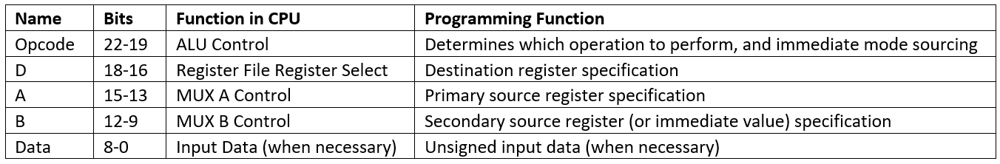
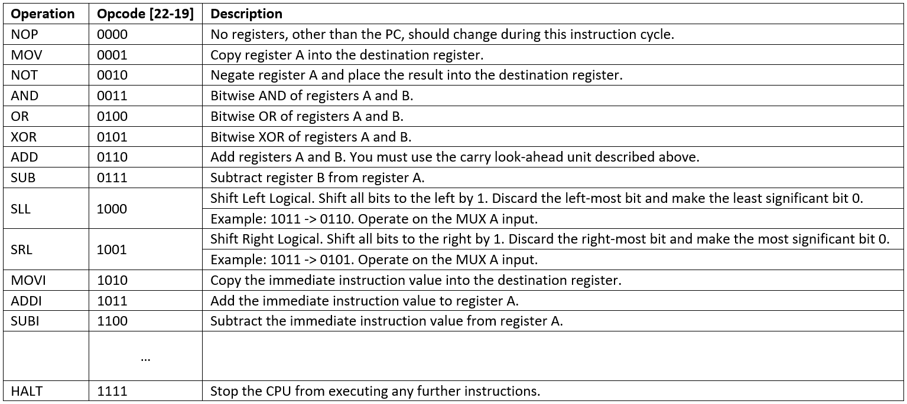

:Author: Justin Perona

================
ECS 154A - Lab 3
================

Due by 08:59 on Wednesday, 2018-09-05.
Turn in for the Logisim portion is on Canvas.
Submit one file named lab3.circ.
Include your name and your partner's name (if necessary) either as a submission comment on Canvas, or in the text entry box when submitting.
Only one partner needs to submit.

Partners are suggested, but not mandatory for the Logisim portion of each lab.
Sharing ideas between groups is fine, but sharing .circ files is not.
Since the written portion is "optional," feel free to do those alone or with your partner.

Written Problems
----------------

1. We benefit by going from one bus to two, and two buses to three. Would we benefit if we start adding significantly more and more buses, say, 300? What would the drawback of having that many buses be?
2. Assume that you have a 64-bit microprocessor, with a 48-bit external data bus, driven by a 4.0 GHz input clock. This microprocessor has a bus cycle whose minimum duration equals 100 input clock cycles. What is the maximum data transfer rate that this microprocessor can sustain?
3. Use the diagram below showing the single bus machine that we discussed in class. We are going to implement an instruction called *TIFU*, where we add the current contents of the IR to the current contents of the PC, then place the result back into the IR. Using the arrow notation that we discussed in class (such as MDR -> Bus, Bus -> MAR), give the steps necessary to implement this instruction.

4. In a Von Neumann architecture, can I treat any piece of data as an instruction?
5. RISC architectures tend to take significantly more instructions to run a program, compared to the same instruction in a CISC architecture. Why are RISC architectures able to run programs faster than CISC architectures, despite the above?
6. Do we need random back-off in a centralized arbitration mechanism for a bus?
7. Name two changes we need to make to a computer in order to support interrupts.
8. Is a "hard drive data ready" interrupt synchronous or asynchronous?
9. What would happen if an interrupt wasn't "invisible" or transparent to a user process?
10. If we have a 2048 word memory, and the word size is 32 bytes, how large is the memory?
11. Draw out a pyramid with five different levels, then place the following memory devices into the levels based on the memory hierarchy that we discussed in class: registers, cache, RAM, solid state disk, tape.
12. Use your memory hierarchy pyramid from the previous problem. Do the following things increase, decrease, or stay the same as we move from the base of the pyramid to the top: size of the memory, speed of the memory, and cost of the memory?

Logisim Problem [60]
--------------------

Your assignment is to build a simple processor that is 9 bits wide, and can do various register transfers and ALU operations over a common bus.
Below is an outline of the overall CPU design.

Allowed Logisim Components
~~~~~~~~~~~~~~~~~~~~~~~~~~

You may use MUXes, a decoder, a RAM, gates, flip flops, and anything in the Wiring library.
Registers and counters are explicitly disallowed.

CPU Diagram
~~~~~~~~~~~

You should follow the diagram below when building your CPU.
It does not address the circuitry that you may need to implement the HALT instruction.

CPU Components
~~~~~~~~~~~~~~

You can break the CPU diagram above into the following components:

**1. ALU**

You have already designed a 3-bit ALU in Lab 1.
You should be able to use that as a starting point for this lab's ALU, though you will need to expand it significantly to support all 9 bits.
Make sure to perform operations bitwise in this lab's ALU.

For the adder and subtractor, you must use carry look-ahead for each group of 3 bits.
This means that you will need to calculate C1, C2, and C3 in the same way that you did before.
(C0 will be 0 unless you are doing a subtraction operation.)
However, C3 can be used as the base for C4, C5, and C6, so you only need to make equations for C4, C5, and C6 in terms of C3.
The same applies for C7, C8, and C9 in terms of C6.
You may disregard the final carry out.

**2. Register File**

Although a CPU would normally store output in memory (RAM), we will not be dealing with memory in this lab.
We will be treating the register values as the "output" of this CPU.

The register file will contain eight 9-bit registers.
On the rising edge of the clock, if the signal *Write Enable* is asserted, the register corresponding to the appropriate one-hot input will be written with the input data value.
You will need to determine when *Write Enable* should be 0 and 1, respectively.

You will want to create a separate subcircuit for a register, which will consist of 9 flip flops.
It is your choice what flip flops you use.
You may not use registers for your registers, you must use flip flops.
Place the registers in the upper-left corner of your circuit, and ensure that each has a tunnel named *R0* to *R7* respectively connecting to the output of the register.

Additionally, you will need to attach a tunnel named *Reset* to the reset pin of the flip flops in your registers.
When the *Reset* signal is set to one, all the registers should be reset to zero.

**3. Decoder**

The decoder will determine the destination register of any output from the ALU by specifying a single high value on one of the eight decoder outputs.

**4. Multiplexers**

Two multiplexers are used to select between the different registers, or the immediate data input into the ALU for the B MUX.
Note that the two multiplexers have a differing number of data bits.

**5. RAM**

You will have one 64 entry x 23 data RAM module with separate load and store ports.
We will only use the RAM as a source of instructions, so we will not use the store port.
The address bits will be sourced from the output of your PC.
The output of the RAM will be the instruction that you should be executing on this cycle.

You will need to hook up the clock to the RAM (the pin is right in the middle).
In addition, on the bottom of the RAM, hook up a power module to the *ld / Load* pin to the right of the clock pin.
Finally, hook up a ground module to the *str / Store* pin at the far left on the bottom of the RAM.
Doing this will ensure that the RAM outputs the instruction value, and doesn't attempt to store any data.

If you want to load a program into the RAM, right click the RAM module, and select *Load Image*.
For example, if you want to load *testall.txt* to run with the grading circuit, load that file into your RAM.
You will need to do this every time you reset the simulation by hitting Ctrl-R.
This is an unfortunate limitation of Logisim.

**6. Program Counter (PC)**

The program counter will be a 6-bit up-counter.
You must make this out of flip flops of any type, and may not use the counter in Logisim.

The PC will feed the RAM the memory location of the instruction it should output.
Additionally, you will need to attach a tunnel named *Reset* to the reset pin of the flip flops in your PC.
When the *Reset* signal is set to one, the PC should be reset to zero.

**7. Control Unit**

The control unit contains the logic to set the ALU to perform the correct operation.
You can pass along the opcode straight to the ALU.

The control wires part is up to you.
You'll probably want to design logic so that MUX B selects the immediate value when you have an instruction that uses the immediate value.
Additionally, you'll probably want to pass a value along to the ALU when you're doing a SUB operation, instead of an ADD.
This way, you'll know when you need to invert the B operand and set C0 to 1, like a subtractor does.

**8. Clock**

Use your own Clock for the sequential components that require a clock.
You may not use the *TClock* tunnel from the grading circuit.
I'd recommend utilizing one clock from the Wiring library, attaching a tunnel to that clock, and using that tunnel name for all the other components that need the clock.

Instruction Format
~~~~~~~~~~~~~~~~~~

The following table describes how an instruction that will be pulled from RAM will be formatted.

Operation Description
~~~~~~~~~~~~~~~~~~~~~

The following table describes what the opcode from the table above corresponds to in terms of operation.
All operations, except for NOP and HALT, place their results in the destination register (D in the instruction).

Given File
~~~~~~~~~~

The given file for this lab, lab3.circ, contains the grading circuit and nothing else.
You will need to build your CPU around this given file.

Feel free to modify anything other than the grading circuit.
**Do not modify the grading circuit.**
You may modify main and add as many subcircuits as you want.
In fact, you are highly encouraged to use subcircuits and tunnels to ensure your main remains clean.

Grading Circuit
~~~~~~~~~~~~~~~

The grading circuit is designed to work with the given file *testall.txt*.
The results won't be valid if you use another testing file, so you'll need to test those by hand.
If the TTYs match the expected output (the text in the middle between the TTYs), your CPU is functioning correctly.

The grading circuit will give you the correct outputs after a simulation reset (Ctrl-R).
If you use the reset button, it occasionally gives you incorrect outputs due to timing issues in Logisim.
If the outputs aren't what you're expecting in the grading circuit, don't worry, just reset the circuit.

Resetting the circuit has the unfortunate side effect of clearing the RAM.
You will need to reload the RAM with the program every time you do this.

Testing Your CPU
~~~~~~~~~~~~~~~~

You will find the binary file assembler.out with the given files.
It is built for a Linux machine, so if you don't have one of your own, you'll need to run it on the CSIF.

You can use the assembler to write your own testing programs.
The assembler uses MIPS-like formats, and generates files that can be loaded directly into a Logisim RAM module.
Here is a short program:

    MOVI R1, #1 (load 1 into R1)

    MOVI R2, #2 (load 2 into R2)

    ADD R3, R2, R1 (add R2 and R1, store result in R3)

    HALT

Run the simulation, and check that the correct registers change to the correct values at the correct times.
For this example, this means that R1 becomes 1, then R2 becomes 2, then R3 becomes 3, then the program halts and no further changes to the CPU state are made.

The *testall.txt* file, which you can find in the same folder as the rest of the given files, does a fairly thorough test of your circuit.
Remember that the grading circuit is only designed to work with *testall.txt*.
You will need to test any other files you make by hand.
