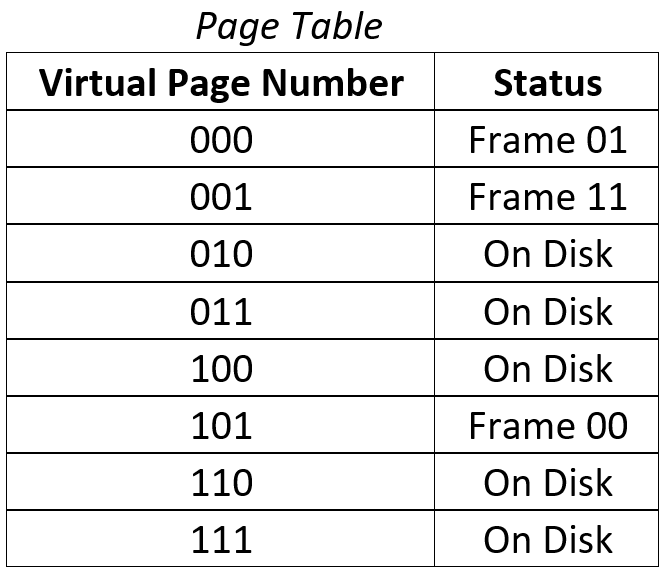

:Author: Justin Perona

================
ECS 154A - Lab 4
================

Due by 09:00 on Thursday, 2018-09-13.
This is the same day as the final.
Due to university regulations, I cannot have an assignment due after the start of the final.
Therefore, **you may not submit this assignment late**.
You have been warned.

Turn in for the C++ portion is on Canvas.
Submit two files, named *dmcache.cpp* and *sacache.cpp*.
Include your name and your partner's name (if necessary) either as a submission comment on Canvas, or in the text entry box when submitting.
Only one partner needs to submit.

Partners are suggested, but not mandatory for the programming portion of each lab.
Sharing ideas between groups is fine, but sharing C++ source code is not.
Since the written portion is "optional," feel free to do those alone or with your partner.

Written Problems
----------------

Since this lab spans multiple weeks, the written portion is divided into its representative weeks.

Week 5
~~~~~~

1. Given a 16 KB byte-addressable DM cache with a 21-bit physical address and a line size of 16 bytes, show how a physical address is laid out for use in the cache. Label each portion of the address, and give the number of bits for each portion.
2. Given a 4 KB byte-addressable DM cache with a 15-bit physical address and a line size of 8 bytes, show how a physical address is laid out for use in the cache. Label each portion of the address, and give the number of bits for each portion.
3. Given a 512 byte byte-addressable FA cache with a 12-bit physical address and a line size of 4 bytes, show how a physical address is laid out for use in the cache. Label each portion of the address, and give the number of bits for each portion.
4. Given a 2 KB byte-addressable FA cache with a 27-bit physical address and a line size of 16 bytes, show how a physical address is laid out for use in the cache. Label each portion of the address, and give the number of bits for each portion.
5. Intel's Nehalem architecture in 2008 had an 8 MB 16-way byte-addressable set associative L3 cache, with a line size of 64 bytes. Assuming a 48-bit physical address, show how a physical address is laid out for use in the L3 cache. Label each portion of the address, and give the number of bits for each portion.
6. Given a 512 KB 4-way byte-addressable SA cache with a 30-bit physical address and a line size of 32 bytes, show how a physical address is laid out for use in the cache. Label each portion of the address, and give the number of bits for each portion.
7. Why are logically addressed caches faster than their physically addressed counterparts?
8. What is the cache aliasing problem?
9. What minimizes the number of writes back to memory: a write-through policy, or a write-back policy?
10. Intel CPUs have typically used a multiple-cache hierarchy. The L1 cache is closest to the CPU, while the L3 cache is the furthest away. How does the L3 cache compare to the L1 in terms of the following: power usage, cost, capacity, and speed?

Week 6
~~~~~~

1. What are the two major objectives of an operating system?
2. Why does a multiprogrammed system require memory protection?
3. In a dynamic partitioning memory management system, what eventually ends up happening as we allocate more and more partitions to processes? What must the OS do in order to counteract this? What is the downside of the action that the OS must take?
4. Pair the following terms together: physical, page, frame, virtual.
5. What is virtual memory thrashing?
6. Assuming a 24-bit virtual address, a byte-addressable memory size of 128 KB, and a page size of 1 KB, show how virtual addresses and physical addresses are laid out for use in this machine's virtual memory system. Label each portion of each address, and give the number of bits for each portion.
7. Assuming a 31-bit virtual address, a byte-addressable memory size of 2 MB, and a page size of 2 KB, show how virtual addresses and physical addresses are laid out for use in this machine's virtual memory system. Label each portion of each address, and give the number of bits for each portion.
8. Using the previous problem, determine how many entries are in the page table, and how wide each entry of the page table is. How does the page table size compare to the size of the entire memory? Will we be able to fit the entire page table into our memory?
9. Using the following page table and the virtual addresses below, either translate the virtual address and give the corresponding physical address, or determine that there will be a page fault. The page size for this virtual memory system is 256 B.

The virtual addresses are below.

    a. 0x25F
    b. 0x0EC
    c. 0x709
    d. 0x5AD

10. What would happen if our TLB had a very low hit rate?

*The following questions are on scheduling, and will not be covered on the final.*

11. What are the three potential ways that a process that is currently Running gets moved out of the Running state?
12. What information does a Process Control Block need to contain?

C++ Problems [50]
-----------------

For this lab, you will be implementing two related cache simulators in C++.
A rough time estimate to complete both is approximately 6 hours.

Direct Mapped Cache [30]
~~~~~~~~~~~~~~~~~~~~~~~~

The file to turn in for this part is *dmcache.cpp*.
You will need to place all your code for this part into one file.
While this isn't necessarily good practice, it means we don't need to deal with Makefiles.

Implement a 512 byte direct-mapped cache with a line size of 16 bytes.
The cache is byte addressable.

Your cache will need to support reading a byte from a cache, and writing a new byte of data into the cache.
This cache will support a write-back write policy, which will require the use of a dirty bit.

In addition, the cache must support a write-allocate write miss policy, in which a write miss causes the appropriate line to be brought into the cache from memory, and the write's value to update the correct part of the line in the cache.
That line then becomes dirty.
This is the same policy that we discussed in class.

Set Associative Cache [20]
~~~~~~~~~~~~~~~~~~~~~~~~~~

The file to turn in for this part is *sacache.cpp*.
You will need to place all your code for this part into one file.
While this isn't necessarily good practice, it means we don't need to deal with Makefiles.

After implementing the direct-mapped cache, you will alter it in a separate file in order to implement a 1 KB, 4-way set associative cache with a line size of 8 bytes.
The other specifications from the direct-mapped cache will remain the same.
You must support read and write operations.
In addition, you must support a write-back policy, and a write-allocate policy.

For your replacement policy, you will implement the least recently used (LRU) replacement policy.
When all ways within a set are full of lines, and you need to bring a new line into that set, you will evict whichever line hasn't been used in the greatest amount of time.

Input
~~~~~

Both caches will take as input a filename from the command line.
The file specified by the filename will be a comma-separated-value (CSV) ASCII file with each line in the following 4-byte format:

========= ==============
**Bytes** **Function**
--------- --------------
1 - 2     16 bit address
--------- --------------
3         Read / Write
--------- --------------
4         1 byte of data
========= ==============

The read function will be designated by 0xFF, and the write function will be designated by 0x00.
Upon a read operation, the data segment of the 4-byte format will be ignored.
However, when a write occurs, the data will be written into the specified byte and the dirty bit for that line will be set.

For ease of parsing, the input file will be a comma-separated-value (CSV) file.
All the data values will be in hex, separated by commas.
An example is below:

=========== ============== ========
**Address** **Read/Write** **Data**
----------- -------------- --------
002D        00             FD
----------- -------------- --------
002E        00             4E
----------- -------------- --------
002D        FF             28
=========== ============== ========

These values would appear in the input file as the following:

    002D,00,FD

    002E,00,4E

    002D,FF,28

The first two lines signify that FD and 4E should be written to the appropriate locations in the cache, and the third line signifies that data should be read from the cache.

Output
~~~~~~

Both caches will generate a comma-separated-value (CSV) file.
The direct-mapped cache will produce a file output named *dm-out.csv*.
Similarly, the set-associative cache will produce a file output named *sa-out.csv*.

Each line of the output file corresponds to the results of each read operation from the input file.
Thus, write operations from the input file have no representation in the output file.

The information on each line will be the following, separated by a comma with no spaces.
Note that the last item won't have a comma following it.

1. The literal string *Data*
2. The byte of data returned by the read operation
3. The literal string *Dirty*
4. The dirty bit for that line of cache at that point in time (for the line being replaced if there was a miss, *not* the line coming in)
5. The literal string *Hit*
6. Whether or not the data was in the cache originally (if we had a hit or not)

For the example that we did in the section above, we would have a one line output file that would appear as follows:

    Data,FD,Dirty,1,Hit,1

Thus, for that read, the data at that location was FD.
The line was dirty, as we had not written it back to main memory yet.
Finally, we had a hit, because we had found it in the cache without having to go to main memory.

Main Memory
~~~~~~~~~~~

An important thing to notice is that when a line gets evicted from the cache, and at some later point is brought back into the cache by a subsequent read, the read must return the correct value, and not just zero.
Your simulator must act as if the value was stored in main memory when it was evicted from the cache.

A specific example of this is in *given/dmcache/dmcache-test-20.csv*.
Line 4 of that file is the following:

    9CA6,00,D2

Line 5 immediately evicts that line:

    40A7,00,7F

However, the read on line 10 is the following:

    9CA6,FF,D2

This read needs to return D2, as it does in line 2 of *given/dmcache/dmcache-test-output-20.csv*:

    Data,D2,Dirty,1,Hit,0

The dirty bit is 1 here because the line **currently** in cache had been modified in line 9 of *given/dmcache/dmcache-test-20.csv*.

You may implement this however you like.
A perfectly acceptable (and easy) way to do it is to have an array of length 65536 (2 to the power of 16) to serve as your main memory.
When cache lines get evicted, the values of the line are sent there.
You should initialize the contents of that memory (as well as your cache) to all 0s.

Testing
~~~~~~~

You will find three test input files for each cache, along with the corresponding correct output files, in *given/dmcache* and *given/sacache*.
Diff your output and mine for each test case to see if your cache simulator is working correctly.
If your program returns the same output for each of the input files, your cache should be working correctly.
